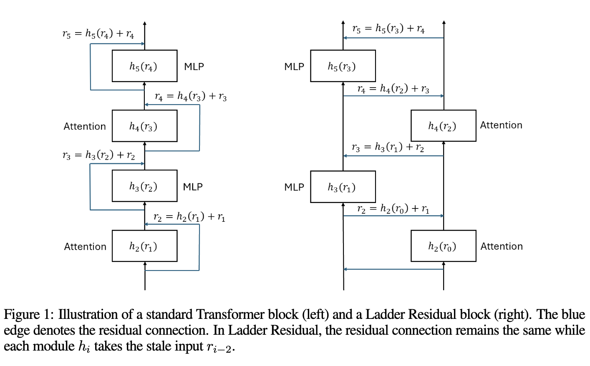

# Ladder-Residual-Inference
This repository contains the code for inference benchmarking for the paper [Ladder Residual: Redifining Tensor Parallelism in Transformers for Accelerated Inference]().

If you are interested in training the Ladder Residual models, you can find the training code in [dolomite-engine](https://github.com/IBM/dolomite-engine).

## Ladder Redisual
Tensor Parallelism (TP) is commonly used to partition a LLM for training and inference on multiple accelerators to reduce the memory load and computation time. However, TP is communication bound and thus requires fast interconnects (like NVLink for NVIDIA GPUs) between the devices. However, these fast interconnects are only available on high-end datacenter GPUs. Even in the presence of these fast interconnects, the TP communication is often a huge bottleneck and thus limits the gains that can be achieved by increasing the number of accelerators.

To mitigate this issue, we propose Ladder Residual: a simple architectural modification applicable to all residualbased models that enable straightforward overlapping that effectively hides the latency of communication. Our insight is that in addition to systems optimization, one can also
redesign the model architecture to decouple communication from computation. For a Transformer model of 8B size, applying Ladder Residual to all its layers achieves 29% end-to-end wall clock speed up at inference time with TP world size of 8 devices. We refer to such model as the Ladder Transformer. We train a 1B and 3B Ladder Transformer from scratch and observe comparable performance to a standard dense transformer baseline. We also conduct adaptation experiments for our approach and show that it’s possible to adapt parts of the Llama-3.1 8B model with minimal accuracy degradation by only retraining for 3B tokens. To further push the performance frontier, we propose another architectural modification which drops communications in the model, unlocking fast LLM inference in settings devoid of NVLink or other fast interconnects.

Ladder Residual Transformer (or simply Ladder Transformer) is a decoder-based transformer LLM architecture that allows overlapping of computation with communication for inference by model architecture modification. The proposed approach doesn't require any custom kernels making the method easily scalable and applicable to different hardware architectures and ML frameworks.



## Usage
To run the code, you can install this repository and run one of the benchmarking scripts as follows:
```shell
pip install -e .
sh scripts/throughput-70B.sh
```

## Acknowledgement
This repository is based on [gpt-fast](https://github.com/pytorch-labs/gpt-fast) and runs completely with PyTorch compile. The model architecture in this repository is based on the Llama architecture.
